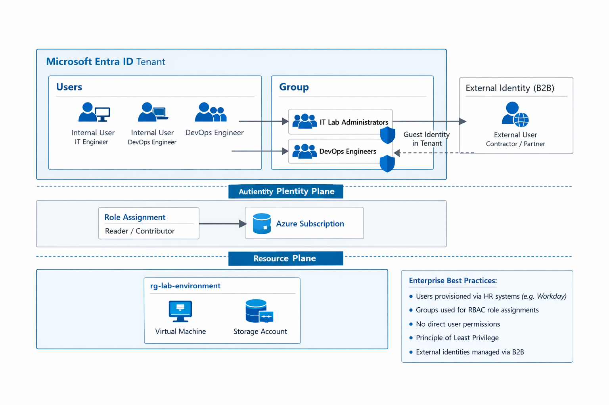

# 🔐 Lab 01 - Manage Microsoft Entra ID Identities (Geek Edition)

## 🎯 Objetivo
Aprender a gerenciar identidades no Microsoft Entra ID com usuários, grupos e convidados, aplicando **naming profissional e divertido**, simulando ambientes corporativos.

---

## 🏗️ Architecture Overview

Este diagrama mostra o fluxo de identidade no Azure usando Microsoft Entra ID:

- Users → Groups → Roles → Subscription → Resources  

> ⚠️ Neste lab, implementaremos apenas Users e Groups.

---

## 🧠 Como ler o diagrama

1. Usuários criados no Microsoft Entra ID  
2. Usuários adicionados a grupos  
3. Grupos recebem permissões (RBAC)  
4. Roles aplicadas na Subscription  
5. Acesso concedido aos recursos  

> Neste lab implementamos apenas steps 1 e 2.

---

## 📂 Estrutura do lab

- **Teoria**: conceitos de identidade, grupos, B2B  
- **Hands-on**: criação de usuários, convidados e grupos  
- **Naming**: convenção geek  
- **Common errors**: erros típicos  
- **Real-world**: contexto de empresa  
- **Scripts**: CLI e PowerShell

---

## 🌟 Naming Convention (Geek Edition)

Estrutura: `<tipo>-<tema>-<número>`

| Tipo   | Tema         | Exemplo             |
|--------|--------------|---------------------|
| user   | Transformers | `user-optimus-01`   |
| guest  | Star Wars    | `guest-rey-01`      |
| grp    | Marvel       | `grp-avengers-01`   |
| vm     | DC Comics    | `vm-batman-01`      |
| rg     | Marvel/DC    | `rg-spiderverse-01` |

> Mantém consistência e permite expansão de labs.

---

## 🧪 Labs deste repositório

| Lab | Tema | Status |
|-----|------|--------|
| 01 | Entra ID Identities | ✅ Completed |
| 02 | RBAC and Subscriptions | 🚧 In progress |

---

## 🏢 Cenário de empresa

- Times distribuídos  
- Necessidade de controle de acesso escalável  
- Uso de grupos para automação de permissões  

---

## ⚠️ Common Mistakes

- Atribuir roles diretamente aos usuários  
- Não usar grupos  
- Naming inconsistente  

---

## 🚀 Próximos passos

- Lab 02: RBAC e Subscriptions  
- Lab 03: Governance via Azure Policy